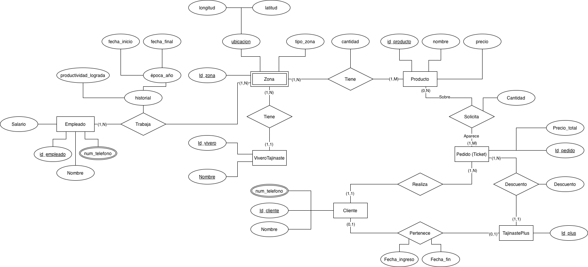
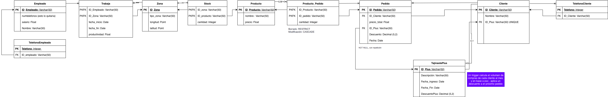

# Sistema de Gestión de Viveros 🌱

## Hecho por

Mario Guerra Pérez \
Victor Rodríguez Dorta

## Descripción

Sistema de base de datos relacional diseñado para la gestión integral de viveros, incluyendo empleados, zonas de trabajo, productos, clientes, pedidos y un programa de fidelización "Tajinaste Plus".

## Diagramas

### Diagrama P03


### Modelo Relacional



## Estructura de la Base de Datos

### Diagrama Entidad-Relación

El sistema está compuesto por las siguientes tablas principales:

#### Tablas Base (Nivel 1)
- **Empleado**: Gestión de personal del vivero
- **Zona**: Áreas de trabajo del vivero
- **Producto**: Catálogo de productos disponibles
- **Tajinaste_plus**: Programa de descuentos y fidelización

#### Tablas Dependientes (Nivel 2)
- **Cliente**: Información de clientes
- **TelefonoEmpleado**: Contactos de empleados
- **TelefonoCliente**: Contactos de clientes

#### Tablas Relacionales (Nivel 3-5)
- **Trabaja**: Relación empleados-zonas
- **Stock**: Inventario por zona y producto
- **Pedido**: Órdenes de compra
- **Producto_Pedido**: Detalle de productos en pedidos

## Características Principales

### Validaciones y Restricciones

- ✅ **Salario mínimo**: Los empleados tienen un salario mínimo de 800€
- ✅ **Precios positivos**: Los productos deben tener precio mayor a 0
- ✅ **Fechas válidas**: Validación de rangos de fechas en Tajinaste Plus
- ✅ **Descuentos**: Rango entre 0-100%
- ✅ **Stock no negativo**: Control de inventario
- ✅ **Cálculo automático**: El precio final de pedidos se calcula automáticamente

### Integridad Referencial

#### CASCADE (Eliminación en cascada)
- Eliminar un empleado → elimina sus teléfonos
- Eliminar un cliente → elimina sus teléfonos y pedidos asociados
- Eliminar una zona → elimina registros de stock
- Eliminar un producto → elimina registros de stock

#### RESTRICT (Prevención de eliminación)
- No se puede eliminar un empleado si trabaja en alguna zona
- No se puede eliminar una zona si tiene empleados asignados
- No se puede eliminar un pedido si tiene productos asociados
- No se puede eliminar un producto si está en algún pedido

#### SET NULL (Anulación)
- Si se elimina un plan Tajinaste Plus → los clientes/pedidos mantienen el registro pero sin descuento

## Instalación y Uso

### Requisitos Previos

- PostgreSQL 12 o superior
- Cliente SQL (psql, pgAdmin, DBeaver, etc.)

### Instalación

1. Clona o descarga el repositorio
2. Conecta a tu servidor PostgreSQL
3. Ejecuta el script completo:
```bash
psql -U tu_usuario -d tu_base_datos -f script_viveros.sql
```

### Estructura del Script

El script está organizado en 5 secciones:
```sql
-- SECCIÓN 1: LIMPIEZA
-- Elimina tablas existentes

-- SECCIÓN 2: CREACIÓN DE TABLAS
-- Crea la estructura de la base de datos

-- SECCIÓN 3: INSERCIÓN DE DATOS
-- Datos de ejemplo para pruebas

-- SECCIÓN 4: VISUALIZACIÓN
-- Consultas SELECT para ver los datos

-- SECCIÓN 5: PRUEBAS DE ELIMINACIÓN
-- Validación de restricciones
```

## Ejemplos de Datos

El script incluye datos de ejemplo:

- 5 empleados con salarios entre 950€ - 2100€
- 5 zonas geográficas (Centro, Norte, Sur, Este, Oeste)
- 5 productos (Café, Té, Chocolate, Miel, Galletas)
- 5 planes Tajinaste Plus con descuentos del 10% al 30%
- 5 clientes registrados
- 5 pedidos de ejemplo

## Consultas Útiles

### Ver todos los pedidos con descuento aplicado
```sql
SELECT 
    p.ID_Pedido,
    c.nombre AS cliente,
    p.precio_total,
    p.descuento,
    p.precio_final
FROM Pedido p
JOIN Cliente c ON p.ID_Cliente = c.ID_Cliente;
```

### Ver stock por zona
```sql
SELECT 
    z.tipo_zona,
    pr.nombre AS producto,
    s.cantidad
FROM Stock s
JOIN Zona z ON s.ID_zona = z.ID_Zona
JOIN Producto pr ON s.ID_producto = pr.ID_Producto;
```

### Ver empleados por zona
```sql
SELECT 
    e.Nombre AS empleado,
    z.tipo_zona,
    t.productividad
FROM Trabaja t
JOIN Empleado e ON t.ID_Empleado = e.ID_Empleado
JOIN Zona z ON t.ID_Zona = z.ID_Zona;
```

## Pruebas de Integridad

El script incluye pruebas para validar:

1. **Eliminación en Producto_Pedido**: Se puede eliminar una línea de pedido
2. **Eliminación CASCADE**: Al eliminar un producto, se eliminan sus registros en Stock y Producto_Pedido
3. **Restricciones CHECK**: Validación de salarios, precios y descuentos

## Notas Importantes

⚠️ **Advertencias**:
- El script incluye `DROP TABLE IF EXISTS` que elimina datos existentes
- Las eliminaciones CASCADE son irreversibles
- Se recomienda hacer backup antes de ejecutar en producción

## Modelo de Datos

### Relaciones Principales
```
Empleado 1:N TelefonoEmpleado
Empleado N:M Zona (a través de Trabaja)
Zona N:M Producto (a través de Stock)
Cliente 1:N Pedido
Cliente 1:N TelefonoCliente
Cliente N:1 Tajinaste_plus
Pedido N:M Producto (a través de Producto_Pedido)
```

## Mantenimiento

### Limpiar base de datos
```sql
-- Ejecutar la sección 1 del script
DROP TABLE IF EXISTS Producto_Pedido;
-- ... resto de tablas
```

### Reiniciar datos de ejemplo
```sql
-- Ejecutar secciones 1, 2 y 3 del script completo
```

## Contribuciones

Para contribuir al proyecto:
1. Realiza un fork del repositorio
2. Crea una rama para tu feature (`git checkout -b feature/nueva-funcionalidad`)
3. Commit tus cambios (`git commit -am 'Añade nueva funcionalidad'`)
4. Push a la rama (`git push origin feature/nueva-funcionalidad`)
5. Abre un Pull Request


**Base de datos**: PostgreSQL
